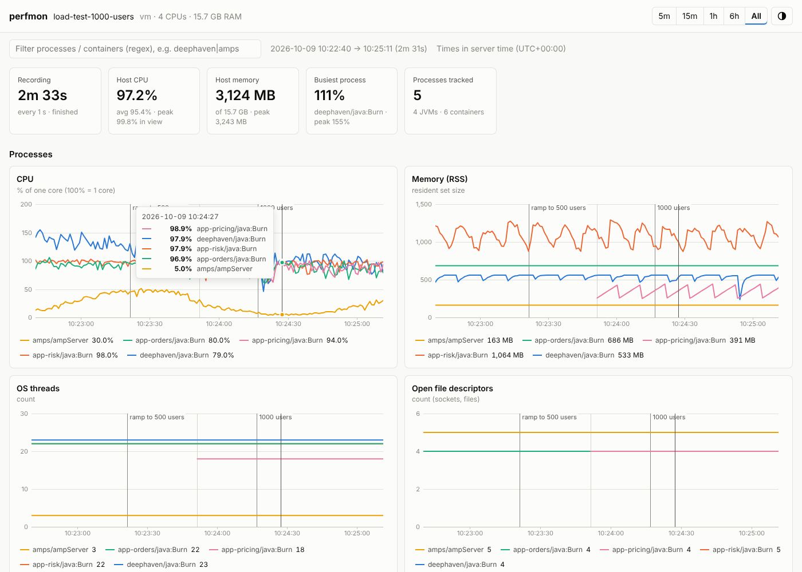

# linux-perf / perfmon

Record **CPU, memory, JVM heap/GC, network and disk** for Docker containers and
the processes inside them (Deephaven, AMPS, any Java service) during a load test.
Every sample goes to CSV. You can watch the charts **live in a browser on your
desktop**, or open a single self-contained HTML report afterwards.

* **Nothing to install.** Python 3.6+ standard library and plain HTML/JS. There
  are no pip packages, no CDN and no agents in your containers, so it works on
  air-gapped boxes.
* **Low overhead.** perfmon reads `/proc` and the cgroup filesystem directly
  (about 1% of one core at a 1 s interval). It never `docker exec`s into your
  containers.
* **JVM heap and GC with no JMX and no jstat.** It reads the HotSpot perf-data
  file (`hsperfdata`) that every JVM already maintains.
* **Container and process view.** Container rows match `docker stats`. Process
  rows add RSS, threads and FDs, so you can tell which process inside a
  container is responsible.



---

## 1. Deploy

Copy the folder to the Linux box. Only `perfmon.sh`, `perfmon/` and the
example config are needed:

```bash
# from your desktop / build box
tar czf perfmon.tgz perfmon.sh perfmon.conf.example perfmon/
scp perfmon.tgz user@loadbox:/opt/
# on the Linux box
cd /opt && mkdir perfmon && tar xzf perfmon.tgz -C perfmon && cd perfmon
```

Requirements on the box: `bash` and Python **3.6+**. RHEL 8's
`/usr/libexec/platform-python` is detected automatically. You also need the
`docker` (or `podman`) CLI. Run as **root** (`sudo`). Root is needed to read
other users' JVM perf-data, count their file descriptors and talk to the
Docker socket.

## 2. Configure

```bash
cp perfmon.conf.example perfmon.conf
vi perfmon.conf          # container / process names for your environment
sudo ./perfmon.sh discover
```

Without a `perfmon.conf`, perfmon records **every process in every running
container**. The example config defines one target per workload:

```ini
[perfmon]
interval = 1                 ; seconds between samples

[target deephaven]
container = deephaven        ; regex on the container name
exe = java                   ; the JVM itself, not its sh wrapper
jvm = yes                    ; heap / GC metrics

[target amps]
container = amps
exe = ampServer

[target java-apps]
container = ^(app|svc)-      ; every container named app-* or svc-*
exe = java
```

`discover` is a dry run. It shows exactly what will be recorded, with current
CPU, memory and heap readings:

```
CONTAINERS (4)
  NAME           IMAGE                       CPU%    MEM MB  LIMIT MB  RX Mb/s  PIDS
  deephaven      ghcr.io/deephaven/server   136.1     482.9    1024.0      0.0    24
  amps           60east/amps:5.3             42.2     158.1     512.0     11.8     1
  ...
PROCESSES (4)
  SERIES                          TARGET      PID    CPU%    RSS MB   THR    HEAP used/max
  deephaven/java:JettyMain        deephaven  2178   136.0     500.2    23       376/512 MB
  amps/ampServer                  amps       2097    41.7     161.3     1                -
  app-orders/java:OrderService    java-apps  2624    91.4     366.3    22       290/384 MB
```

Target options (all regular expressions):

| option      | matches                                                              |
|-------------|----------------------------------------------------------------------|
| `container` | container name (search). Omit `container` and `image` to match processes on the host itself |
| `image`     | image name                                                           |
| `exe`       | executable name, full match (`java`, `ampServer`)                    |
| `process`   | anywhere in the full command line (e.g. a main class)                |
| `exclude`   | command lines to skip                                                |
| `label`     | fixed display name instead of the derived one                        |
| `jvm`       | `auto` (default: on for `java`), `yes`, `no`                         |

Series are named `<container>/<name>`. For Java processes, the name is the
main class, jar or module (`java:JettyMain`, `java:orders-1.2.jar`). A process
that restarts keeps its series. The restart shows as a gap plus an event marker.

## 3. Run a load test

```bash
sudo ./perfmon.sh start 500-users          # background recorder -> data/<timestamp>_500-users/
sudo ./perfmon.sh web                      # dashboard on :8080 (leave it running)
./perfmon.sh mark "ramp to 500 users"      # vertical marker on every chart
./perfmon.sh mark "steady state"
sudo ./perfmon.sh stop                     # stops and writes data/<run>/report.html
./perfmon.sh summary                       # avg / p95 / max table in the terminal
```

Alternatively, wrap your load-test command. perfmon then starts, marks the
start and end, cools down, stops and writes the report:

```bash
sudo ./perfmon.sh wrap 1000-users --cooldown 30 -- ./run-gatling.sh --users 1000
```

Other commands: `status`, `list`, `report [RUN] [--resample 10s]`, `web-stop`.
Add `-i 2 -d 1h` to `start` for a 2-second interval that stops after 1 hour.
Run `./perfmon.sh help` for the full list.

## 4. Watch from your desktop

`./perfmon.sh web` prints the URLs to open:

```
perfmon dashboard serving /opt/perfmon/data
  open from your desktop:  http://loadbox:8080/
                           http://10.20.30.40:8080/
```

* **Live:** the default "Latest run (auto-follow)" view updates every interval
  and switches to a new recording automatically. Leave it open across tests.
* **History:** pick any earlier run from the drop-down.
* **Firewall in the way?** Tunnel it over SSH and open `http://localhost:8080/`:
  ```bash
  ssh -L 8080:localhost:8080 user@loadbox
  ```
* **Shared network?** Add a login (`web_auth = user:password` in
  `perfmon.conf`, or `./perfmon.sh serve --auth user:pw`), or bind to
  localhost (`web_bind = 127.0.0.1`) and use the tunnel. The server is
  read-only: it only serves the UI and the run CSV files.

Using the charts:

* Drag across any chart to zoom every chart to that time range. Double-click to
  reset.
* The summary tables (avg / p95 / max, RSS growth, GC totals) always cover the
  range in view. Zoom into the steady-state phase to get clean numbers for
  your test report. Each table has a **Download CSV** button.
* Click a legend entry to hide that series everywhere. Type in the filter box
  (regex, e.g. `deephaven|amps`) to narrow all charts and tables.
* **Download report** saves a single HTML file containing all data. It opens
  offline in any browser and can be emailed or attached to a ticket.

## 5. What is recorded

Each run is a directory of CSV files. They open directly in Excel, pandas or
anything else.

```
data/20261009-101500_500-users/
  meta.json        host, CPUs, RAM, interval, targets, start/end
  processes.csv    per matched process
  jvm.csv          per JVM
  containers.csv   per container (cgroup)
  host.csv         whole machine
  markers.csv      your marks + automatic process/container start/stop events
  recorder.log
  report.html      written by `stop` / `report`
```

| file | columns |
|------|---------|
| `processes.csv` | `cpu_pct` (`user_pct` + `sys_pct`), `rss_mb`, `swap_mb`, `vsz_mb`, `threads`, `fds` |
| `jvm.csv` | `heap_used_mb`, `heap_committed_mb`, `heap_max_mb`, `young_used_mb`, `old_used_mb`, `metaspace_mb`, `gc_young_count`/`_ms`, `gc_full_count`/`_ms`, `gc_other_count`/`_ms` (per interval), `gc_pause_pct`, `java_threads` |
| `containers.csv` | `cpu_pct`, `cpu_limit_cores`, `throttled_pct`, `mem_used_mb`, `mem_limit_mb`, `mem_pct`, `mem_cache_mb`, `net_rx_mbps`, `net_tx_mbps`, `disk_read_mbs`, `disk_write_mbs`, `pids` |
| `host.csv` | `cpu_pct`, `iowait_pct`, `steal_pct`, `load1`, `mem_used_mb`, `mem_avail_mb`, `swap_used_mb`, `net_rx_mbps`, `net_tx_mbps`, `ctx_switches_ps`, `collector_cpu_pct` |

Every row also has `time` (server local time) and `epoch`.

Definitions:

* **CPU %** for processes and containers is top-style: 100% = one fully busy
  core, so 350% = 3.5 cores. Host CPU % is the share of *all* cores.
* **Container memory** is cgroup usage minus inactive page cache, the same
  figure `docker stats` shows. `mem_cache_mb` is the page cache.
* **Throttling** is the percentage of CFS periods in which the container hit
  its `--cpus` limit. If this is above zero during a test, the container is
  CPU-capped and latency suffers before CPU % looks "full".
* **GC pause %** is the share of wall time spent in GC pauses during the
  interval (the same counters `jstat -gc` reads; GCT = young + full + other).
* **Network** is Mbit/s, read from the container's network namespace.
  Containers using `--network host` share the host's interfaces, so they show
  no per-container network (see the host network chart).

## 6. JVM notes

* Heap and GC data come from `/tmp/hsperfdata_<user>/<pid>` inside the
  container, read from the host via `/proc/<pid>/root`. The format is the same in every
  HotSpot JDK since 8. It was tested here with JDK 21 using G1, Parallel and
  ZGC. The image doesn't need JDK tools.
* If `discover` shows `no hsperfdata`, either the JVM runs with
  `-XX:-UsePerfData` or `-XX:+PerfDisableSharedMem` (remove that flag), or
  perfmon isn't running as root.
* **ZGC** maps the heap several times, so its RSS overstates real memory use.
  Read the heap chart and the container memory for ZGC services.
* For leak hunting, watch **Old generation used**: a floor that keeps rising
  after each GC means retained objects. The summary's **RSS Δ** column shows
  growth over the range in view.

## 7. No Python on the box?

Run perfmon itself in a container. It needs the host's PID, network and cgroup
namespaces, and the Docker socket:

```bash
docker run -d --name perfmon --pid=host --network=host --cgroupns=host --privileged \
  -v /sys/fs/cgroup:/sys/fs/cgroup:ro \
  -v /var/run/docker.sock:/var/run/docker.sock -v "$(command -v docker)":/usr/bin/docker:ro \
  -v /opt/perfmon:/perfmon -w /perfmon \
  python:3.12-slim python -m perfmon record -n my-test
# dashboard the same way: ... python -m perfmon serve
```

The host's `docker` binary is a static Go binary, but it needs a glibc at
least as new as the one it was built against. Use a recent base image.
(`--cgroupns` requires Docker 20.10+.)

## 8. Troubleshooting

| symptom | fix |
|---------|-----|
| `container discovery failed: permission denied` | run with `sudo`, or set `docker_cmd = sudo docker` |
| a process is missing in `discover` | check its name with `docker top <container>`. `exe` must match the executable exactly. Use `process` for command-line text |
| container rows but no process rows | the process regex didn't match. Try `process = .*` and narrow down |
| JVM heap shows `no hsperfdata` | see [JVM notes](#6-jvm-notes) |
| page loads, charts empty | no recording yet. `./perfmon.sh start test` (the dashboard auto-follows) |
| cannot reach `:8080` from the desktop | firewall: use the SSH tunnel above, or open the port (`firewall-cmd --add-port=8080/tcp`) |
| browser slow on multi-hour runs | record with `-i 2`..`-i 5`, or make a smaller report with `report --resample 10s` |
| podman | `docker_cmd = podman` (rootful). Untested here, but discovery uses the same `ps --format` template and podman's `libpod-<id>.scope` cgroups are matched the same way |

## 9. How it works

```
 discover (every 10 s)                 sample (every interval)
 ─────────────────────                 ──────────────────────────────────────────────
 docker ps  → container ids/names      /proc/<pid>/stat,status   → processes.csv
 /proc/*/cgroup → which pid lives in   /sys/fs/cgroup/<container> → containers.csv
   which container                     /proc/<pid>/net/dev        ↗
 [target] rules → tracked processes    /proc/<pid>/root/tmp/hsperfdata_*/<nspid> → jvm.csv
                                       /proc/stat, meminfo, net/dev → host.csv
```

The web server (`perfmon/server.py`) is a small read-only HTTP server. The
browser fetches each CSV from a byte offset, so a live update only transfers
new rows. Charts are drawn by a ~450-line canvas library
(`perfmon/web/chart.js`) with min/max decimation, so spikes stay visible at any
zoom level. The library supports cgroup v1, v2 and hybrid, and both the systemd
and cgroupfs Docker drivers.

Tests (standard library only; one test uses a real JVM if `java` and `javac`
are present):

```bash
python3 -m unittest discover -s tests -v
```

### Alternatives

For a permanent, fleet-wide setup, the usual stack is
**cAdvisor + node-exporter + Prometheus + Grafana**, with JMX exporter for
JVMs. perfmon is aimed at the load-test case: one box, no infrastructure, one
command to start, and a portable artefact (CSV + HTML) per test run.
